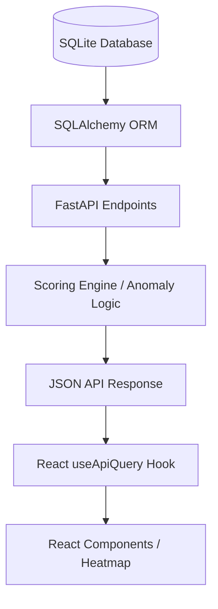

# TCIS Technical Project Report: Building a Sales Map Tool

## Project Overview
TCIS (Tally Client Intelligence Suite) is a tool I built to help sales and support teams at the company handle their Tally Prime business better. Instead of just listing leads, it uses some math to tell you **who** to call first, **where** the market is growing in India, and **which** clients might buy more stuff.

The core idea here is **Simple Scoring Rules**. Every score is based on clear rules we can explain to anyone.

---

## Technical Stack
I chose these tools because they are fast, modern, and play well together:

### 1. Frontend (The UI Layer)
- **React (Vite)**: Super fast development and optimized production builds.
- **Tailwind CSS**: Used for the entire design system. I avoided standard UI libraries to create a custom, "premium" glassmorphism look.
- **Lucide-React**: For a clean, consistent icon set.
- **Recharts**: For the radar charts and trend lines.
- **@react-map/india**: A key library used to build the interactive 36-state heatmap.

### 2. Backend (The Logic Layer)
- **FastAPI (Python)**: High-performance async API framework. Extremely easy to use with Pydantic for data validation.
- **SQLAlchemy**: Our ORM of choice to interact with the database.
- **Uvicorn**: The ASGI server running our backend.

### 3. Database
- **SQLite**: Used for this version to keep it portable. It stores our Leads, Clients, Tickets, and the "Brain" (Scoring Config).

---

## System Architecture
Here is how the data flows from the database to the user's screen:

---

## The "Brain": Dynamic Scoring Engine
The coolest part of the code is how it calculates scores. Most apps hardcode these values, but I built a system where weights can be tuned in real-time.

### 1. Lead Scoring Formula
A lead score is 0-100 points, broken down like this:
- **Base (70 pts)**: A weighted average of Industry Sector, Company Size, and Source Quality.
- **Bonus (15 pts)**: Based on how many specific product modules they showed interest in.
- **Recency (15 pts)**: A decay factor. If we haven't talked to them in 90+ days, this score drops significantly.

### 2. Client Upsell Scoring
We identify high-value clients across three vectors:
- **Product Gap**: If they own Tally but not MIS or GST modules, they get more "upsell" points.
- **Implementation Recency**: Clients who haven't started a new project in over a year are "stagnant" and flagged for re-engagement.
- **Strategic Fit**: Matching their sector to our most successful automation packs.

### 3. Dynamic Weight Tuning
In `backend/app/routers/scoring.py`, I implemented a function `get_weights_from_db`. This means when an admin changes a weight in the UI, the frontend calls a `PATCH` endpoint, updates the DB, and every score in the entire system updates instantly.

### 4. Lead-to-Client Promotion (Conversion)
I built a transaction-safe handoff mechanism that bridges Sales and Service:
- **Atomic Handoff**: When a lead is marked as "WON," a one-click promotion system creates a Client record, migrates all contact/geo data, and preserves the original Lead ID for audit history.
- **Automated API Handoff**: The system supports external purchase triggers (e.g., from a billing server) that can convert a lead automatically via the `/api/clients` endpoint.
- **Continuity**: The client inherits the lead's historical scoring context, ensuring the analytics don't "reset" when they buy a license.

---

## Geocentric Intelligence (India Heatmap)
I spent a lot of time on the **Growth Zones** dashboard. This isn't just a static map; it's a "State-Slicer":
- **Opportunity Density**: We aggregate the total score of all leads/clients in a state and divide by a scaling factor to determine a "Heat" level (Emerald, Indigo, or Amber).
- **Market Velocity (Anomaly Detection)**: This is a custom algorithm I wrote. It compares the **Average Score of the last 30 days** against a **Historical Baseline (30-90 days ago)**. If a state sees a >20% growth pulse, it triggers a "High Velocity Account" alert.

---

## Technical Challenges & Solutions

### 1. The "Unmapped" Problem
Not all data from old CRMs is clean. I added a logic block that counts accounts missing state/city info and buckets them into an **"Unmapped"** count. This ensures the dashboard stays accurate without losing data.

### 2. Component Failure (Error Boundaries)
Map libraries can be heavy. To prevent a map crash from killing the whole app, I wrapped the India SVG in a custom `LocalErrorBoundary`. If the map fails to load, the user just sees a "Retry" button instead of a white screen.

### 3. Backend Hardening
When building the Admin Panel, I realized users might type negative weights or huge numbers. I added **Pydantic validation** and explicit backend checks to ensure weights stay strictly between `0.0` and `1.0`.

---

## Future Roadmap (Next Steps)
If I were to take this project further, I would:
1. **Migrate to PostgreSQL**: For better concurrency and JSONB support.
2. **WebSocket Updates**: To push "High Velocity" alerts to users the second a new lead is added.
3. **Advanced Hierarchy**: Expand the "Parent-Child" relationship view to handle complex corporate conglomerates.

---
*Report written by the intern (Tally Project)*
